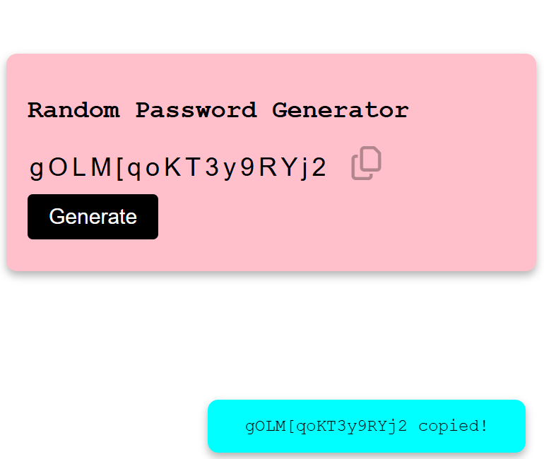

## 🔐 Random Password Generator  

A simple and secure **Random Password Generator** built using HTML, CSS, and JavaScript. This tool helps users generate strong and customizable passwords for enhanced security.  

## 🚀 Features  
- ✅ Generate strong passwords instantly  
- ✅ Customize password length
- ✅ Password types (letters, numbers, symbols)  
- ✅ Copy password to clipboard with one click  
- ✅ Responsive and lightweight design  

## 🛠 Tech Stack  
HTML, CSS, JavaScript  

## 📷 Screenshots  
  

## 📌 How to Use    
1. Select the desired password length.
2. Click the "Generate" button.
3. Copy and use your secure password.

## 📥 Download & Installation  
Clone the repository using Git:  
```bash
git clone https://github.com/luminous44/Random-Password-Generator.git
```
Or download the ZIP file manually from [here](https://github.com/luminous44/Random-Password-Generator/archive/refs/heads/main.zip). 

 
